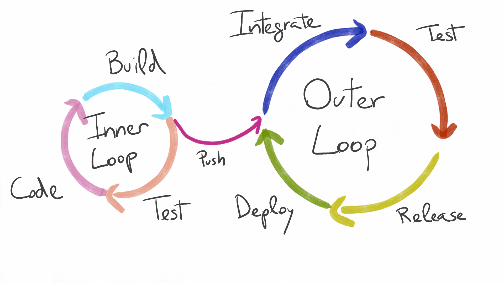

# Developer Experience loops

The developer experience is the workflow a developer uses to develop, test, deploy, and release software.

Typically this experience has consisted of both an inner dev loop and an outer dev loop.&#x20;

The inner dev loop is where the individual developer codes and tests, and once the developer pushes their code to version control, the outer dev loop is triggered.

The outer dev loop is _everything else_ that happens leading up to release. It includes code merge, automated code review, test execution, deployment, controlled (canary) release, and observation of results. The modern outer dev loop might include, for example, an automated CI/CD pipeline as part of a GitOps workflow and a progressive delivery strategy relying on automated canaries, i.e. to make the outer loop as fast, efficient and automated as possible.

\

<figure><figcaption></figcaption></figure>

### &#x20;
